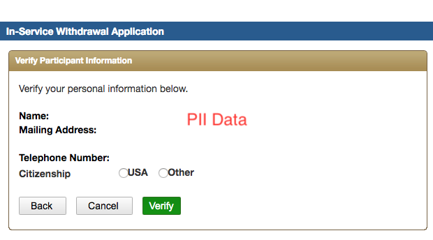
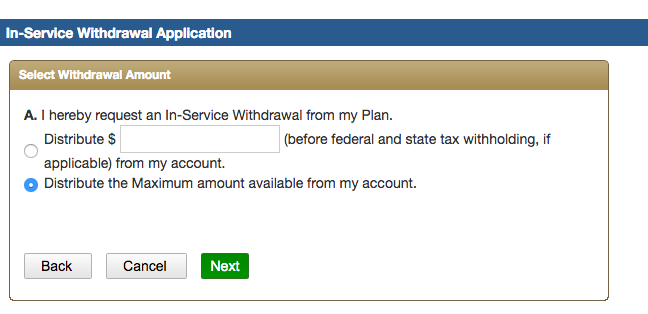
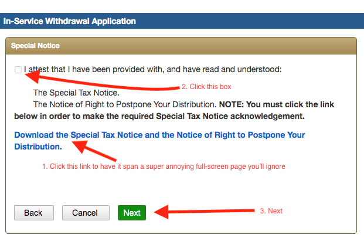
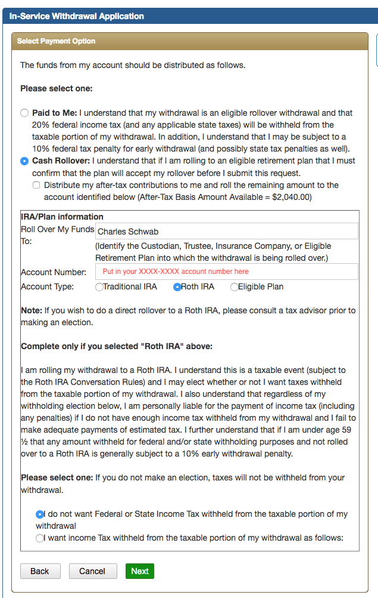
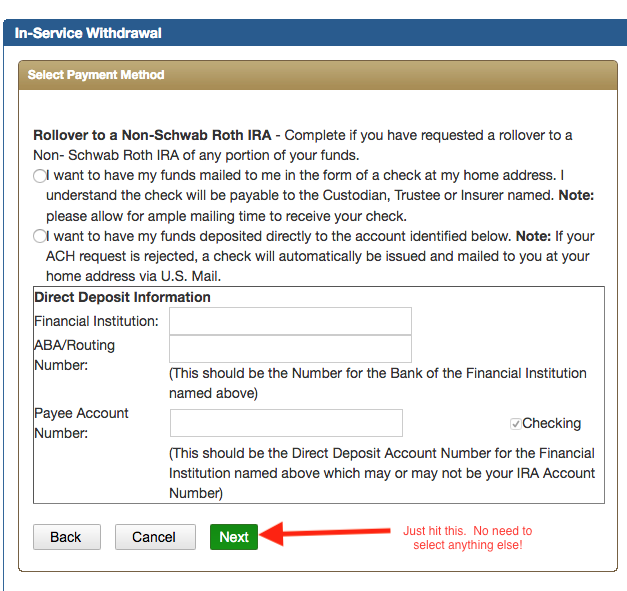
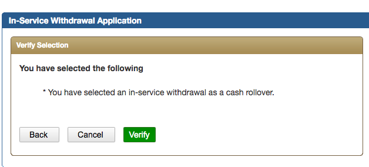

:::note
This was highly specific to my employer, but enough people wanted to access it when not on VPN/intranet, that I've moved it out here.  I will refer to my company as Acme Inc (purveyor of the internet's finest anvils!)
:::

## Background
Starting in 2019 Acme got with the program and started allowing three things that weren't allowed before.  
* You can make after tax contributions to your 401(k)
* You can take in-service withdrawals 
* You can roll IRAs into your 401(k) (I'm actually not going to go into the details of this for version 1)

"Yippee," you say.  "Woohoo, much excites.  So glad you put up a intranet page for this breaking news."

But, it is pretty cool, and here is why.

## After tax contributions to your 401(k)
Per the IRS you are only allowed to contribute up to $19,000 annually (changes with the year, but close enough to this number) to a 401(k).  Additionally, your employer can provide matching contributions, which Acme does.  All pretty standard stuff.

But, the maximum annual contribution to a 401(k) is $57,000 (ish).  The astute among you will notice that 56 - 19 - $employer_match > 0.  As a matter of fact, it's at least $26,100.00.  What an after-tax contributions does is allow you increase your savings in a tax advantaged manner.

### Notes
* After tax is not the same as a Roth 401(k), even though Roth is after-tax.  Yes, it's confusing.
* No, you can't write a check to do it.  It has to come from payroll deductions.

## In-service withdrawals
The second step of this tango is that you are now allowed to take money that is in your after-tax 401(k) and move it out to an external Roth IRA, while you still work for the company.  Now, you could do this with all of your contributions, but with just about all of them they have nasty taxes and penalties, or they require for things to be going really wrong in your life.  But, for the after-tax contributions, that's not true.  They've already been taxed, so you can pretty easily move them around.  

### Why?
So, why would you want to do this?  The reason is taxes.

Much like a traditional IRA, all of the gains on your after-tax contributions are tax-deferred.  This means that in the future, when you go to withdraw this money, you will pay taxes on the earnings.  

However, Roth vehicles (Roth IRA or Roth 401k) are tax-free.  That means all of the gains are never taxed, because you paid taxes on the initial contributions.
What you can now do is make a contribution after-tax and then immediately roll it into a Roth vehicle.  You will pay taxes on the earnings (likely to be a few dollars at most) and from then on out it's tax free.

### How?

Having gone through this process there are a few options:
* Roll-over to to a Roth IRA 
  * via check transfer
  * via ACH transfer
* In kind transfer to Roth 401(k)

## Roll-over to a Roth IRA
### via check transfer
#### Advantages
* You don't have to talk to humans
* You have a wider ranger of investment options
#### Disadvantage
* You have to setup a Roth IRA somewhere.  You may have to handle checks if you're doing external institutions.

### Steps
* Setup a Roth IRA somewhere.   
  * I've done it at Schwab, but your favorite institution works fine.  Doing it in-house at Schwab really isn't any different than a check to an external company.  Evidently they "mail" the check to themselves. 
    * If you do it with Schwab, recognize you can't do it by calling a Schwab Plan representative.  You have to do it from the "retail" side.  Once you have it there, they can initiate the transfer, which is what I did.
* Then, initiate a transfer of the money to the Roth IRA

Now, on to step by step screen grabs to show you what to do.

Ok, if you're not a US Citizen for this next one, you'll need to provide some documentation the first time you do it.  After that, you should be ok.

Hey, for this next one put whatever company you have your stuff at in the "Roll Over My Funds" box. 

## Transfer to a Roth 401(k)
You can also simply transfer this money into your Roth 401k. 
### Advantages
* It's just a phone call
* Don't have to have other accounts open
* With the PCRA option, you can self direct what ETFs or stocks you want to invest in, similar to the IRA options.
### Disadvantages
* You have to talk to humans
* Needs to be done during business hours
### Steps
* Call into Schwab Plan (800-724-7526) and talk to them during business hours.
* They will read forms to you over the phone and fill them out, and then it will be done.
* Or so they tell me, I went with the first method

## See also
* [Bogleheads](https://www.bogleheads.org/wiki/Backdoor_Roth)
* [Doughroller](https://www.doughroller.net/retirement-planning/pros-and-cons-of-after-tax-401k-contributions/)

